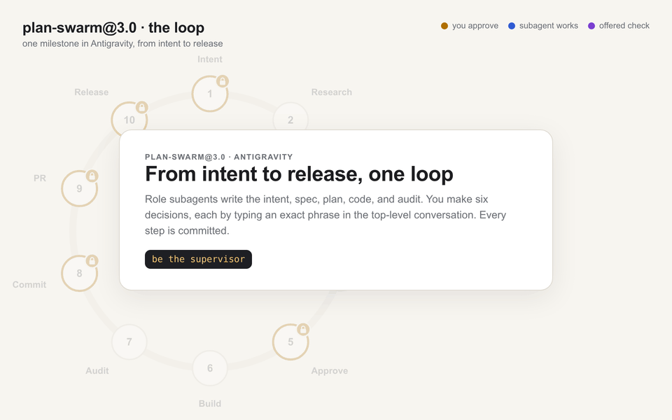

# Plan Swarm: an AI-native SDLC for Antigravity

<picture>
  <source media="(prefers-color-scheme: dark)" srcset="images/lifecycle/plan-swarm-loop-dark.gif">
  
</picture>

A disciplined swarm of role agents, deliberative panels, and adversarial validators that takes a feature, bug fix, or refactor through **intent → spec → plan → parallel build → audit → commit → pull request → release**, with a hook-enforced control plane: nothing is committed, pushed, or tagged without the user's exact approval phrase, and every approval is recorded in git.

The swarm ships as one plugin, [`plan`](plugins/plan/README.md) (plan-swarm@3.0), for **Antigravity**. It comes in two packagings generated from a single source file per role: skills (loaded into the current conversation) and agents (dispatched as subagents with `invoke_subagent`).

---

## How it works

- **Intent first.** Every change starts as a short intent in `plans/intents/`. Nothing is specified or built until the user accepts it.
- **Artifacts, not chat.** Each stage commits one Markdown file that the next stage reads: `intent.md` → `spec.md` (Gherkin) → `plan.md` (test-first micro-steps in parallel groups) → code + `audit.md` → PR.
- **Six human gates.** The user types `approve intent`, `approve spec`, `approve plan`, `approve commit`, `approve pr`, and `approve release` in the top-level Antigravity conversation. An Antigravity hook turns each phrase into a single-use approval bound to the current commit; another refuses every commit, push, or tag without one.
- **A ledger in git.** Each approval is a row in the milestone's `approvals.md`, committed with the change it authorizes. Git hooks and a CI job check every commit against it.
- **Risk tiers.** Each milestone gets a tier (routine, elevated, critical) from rules in `plans/swarm.md`. The tier decides how strongly the supervisor recommends the optional validators, deliberators, and recap; the user decides whether they run.
- **Parallel build.** Up to five engineers work at once, each in its own git worktree, under strict TDD. The group is squashed, audited with `file:line` evidence in a tracked `audit.md`, and committed by the auditor, the only role that commits.
- **Pull request and metrics.** In the default pr mode each milestone lives on `swarm/{m}` and ends in a PR whose body is built from the artifacts. Lead times, first-pass audit rate, rework, cost, and intent survival are computed from the committed files.

---

## Quick start

1. **Install the plugin.** Place or symlink `plugins/plan` at `~/.gemini/config/plugins/plan`:

   ```bash
   mkdir -p ~/.gemini/config/plugins
   ln -s "$PWD/plugins/plan" ~/.gemini/config/plugins/plan
   ```

   The plugin's hooks load for new conversations.

2. **Prepare your repository.** In an Antigravity conversation on the repository you want the swarm to work on, say **"swarm init"**. The `swarm-init` skill installs `plans/swarm.md` (settings), three git hooks (`pre-commit`, `pre-merge-commit`, `pre-push`), and optionally `REVIEW.md`, a CI ledger-check workflow, and an `AGENTS.md` skeleton (skipped if the repository already has `AGENTS.md` or `GEMINI.md`). It never overwrites files. Fill in your build and test commands, review `plans/swarm.md`, and commit both.

3. **Start the supervisor.** In a top-level Antigravity conversation, say **"be the supervisor"** and describe what you want. The supervisor dispatches every role as a subagent with its own context; type the approval phrases in this conversation.

The hooks enforce approvals only in repositories that have `plans/swarm.md`.

---

## Documentation

| Document | For |
|---|---|
| [`docs/`](docs/README.md) | Long-form guides (self-contained HTML): [AI-DLC concepts](docs/ai-dlc.html), [architecture](docs/architecture.html), [end-to-end usage](docs/usage-e2e.html), [developer playbook](docs/playbook.html), [walkthrough of the Antigravity port](docs/walkthrough.html). |
| [`images/`](images/README.md) | Visual introductions: the animated loop, an interactive explainer, a one-page cheatsheet. |
| [`examples/`](examples/README.md) | `e2e_demo.py`: one milestone through every stage against the real hooks. |
| [`plugins/plan/README.md`](plugins/plan/README.md) | Lifecycle, skills, control plane, approval phrases, artifact map, configuration, development. |
| [`plugins/plan/SUBAGENTS.md`](plugins/plan/SUBAGENTS.md) | The agents form: tool contracts and dispatch with `invoke_subagent`. |
| [`plugins/plan/agents/README.md`](plugins/plan/agents/README.md) | The generated `agents/` directory. |
| [`plugins/plan/topology.md`](plugins/plan/topology.md) | The plan-swarm@3.0 graph (machine-readable). |
| [`plugins/plan/evals/README.md`](plugins/plan/evals/README.md) | Behavioral evals and how to run them in Antigravity. |
| [`plugins/plan/templates/global-hooks.example.md`](plugins/plan/templates/global-hooks.example.md) | Platform teams: registering the gate outside the plugin. |

---

## Development

- Roles are edited only in `plugins/plan/roles/<role>.md`; regenerate the agents and skills with `python3 plugins/plan/lib/render_roles.py` (`--check` reports drift).
- Tests: `python3 -m pytest -q plugins/plan/lib/tests`. The plugin code uses only the Python standard library.
- The model is selected globally in Antigravity; every role runs on it.