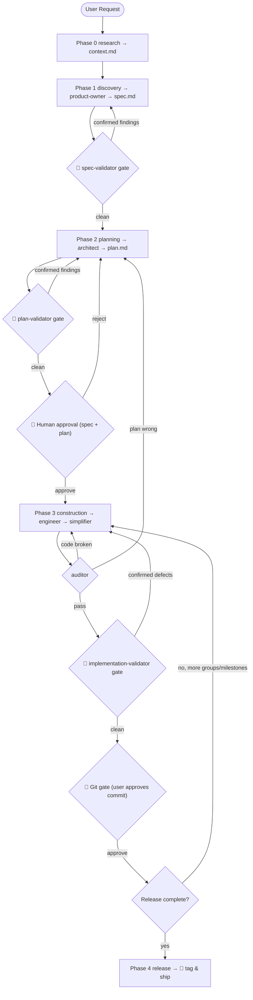

# Orchestrator — Spec-Driven Design Supervisor

A plugin that adds a **Supervisor skill** and a set of **self-contained phase skills** which orchestrate
the eight specialist skills in the sibling [`plan`](../plan) plugin into a single, gated,
*spec → plan → build → ship* lifecycle.

The Supervisor does no work itself. It **routes** between phases based on files on disk, **enforces**
an adversarial validation gate at every handoff, and is the **sole git authority**. Delegation is
**runtime-agnostic** — the protocol hands off *file paths*, so it runs unchanged whether skills are
activated by Gemini (`activate_skill`) or Claude Code (the `Skill` / `Agent` tools).

## Why it exists

The `plan` plugin grew from 4 roles to **8 skills** — adding `spec-validator`,
`plan-validator`, `implementation-validator`, and `simplifier`. Those
validators are designed to sit *between* phases ("after a spec, before a plan"; "after a plan, before
executing"; "after code, before merge"), but nothing dispatched them. This plugin wires them into the
seams.

## The enriched lifecycle



## The skill set

| Skill | Phase | Role | Delegates to (`plan` plugin) |
|---|---|---|---|
| `supervisor` | — | Router, gatekeeper, git authority. **Start here.** | (all, via the phase skills) |
| `research` | 0 | Investigate the codebase → Context Report | *(built-in investigation)* |
| `discovery` | 1 | Author + validate the spec | `product-owner` → **`spec-validator`** |
| `planning` | 2 | Author + validate the plan | `architect` → **`plan-validator`** |
| `construction` | 3 | Implement, refine, audit, attack, commit | `engineer` → `simplifier` → `auditor` → **`implementation-validator`** |
| `release` | 4 | Tag & ship | `product-owner` |

All eight **specialist** `plan` skills are exercised, none orphaned. (The `plan` plugin also ships a ninth
skill, `starter` — the legacy all-in-one supervisor system prompt — which this orchestrator supersedes and
does **not** delegate to; see *Install & activate*.) The four cross-cutting **contracts** (artifact map,
delegation contract, gate semantics, git authority) are defined once in `supervisor/SKILL.md` and
referenced by the phase skills.

## Artifact map (single source of truth)

```
plans/00-ROADMAP.md                                  # master roadmap — product-owner owns it
plans/research/{topic}_context.md                    # research context report (Phase 0)
plans/active_milestones/{moniker}/context.md         # research report, moved in during discovery
plans/active_milestones/{moniker}/spec.md            # product-owner output
plans/active_milestones/{moniker}/plan.md            # architect output
plans/active_milestones/{moniker}/data-model.md      # architect output (optional)
plans/active_milestones/{moniker}/api-contracts.md   # architect output (optional)
plans/active_milestones/{moniker}/validation/        # gate verdicts (this orchestrator's convention)
    spec-validation.md  plan-validation.md  impl-validation.md
plans/audit/AUDIT_{plan}.md                          # auditor (keep plans/audit/.gitignore = *)
```

Because every phase writes to fixed paths and declares a precondition → exit-gate, the Supervisor
re-derives the current phase from disk each turn. The pipeline is therefore **resumable** — interrupt it
and ask the Supervisor to "continue", and it picks up at the earliest unsatisfied gate.

## Validation gates (default-on, skip-for-trivial)

Three adversarial gates are **mandatory for complex milestones**, in order: **spec → plan →
implementation**. Each runs a validator skill (an independent 3-skeptic panel with a 2-of-3 majority),
persists its verdict to `validation/*.md`, and loops back to the producer on any *confirmed* finding
(re-running the panel exactly once). *Unconfirmed* findings are surfaced, never silently dropped. The
implementation gate additionally **reports its severity-calibration delta** to the user (e.g. "claimed
Critical → corrected to High, conditional on concurrency") — the panel's most decision-useful line.

**Trivial fast-path:** a typo / one-line / no-edge-case change may bypass grilling and all three gates,
going straight to a minimal plan → `engineer` → `auditor`. When in doubt, treat the milestone as complex.

Two **human checkpoints** plus the git gate are never skipped: 🛑 approve spec+plan before building,
🛑 approve every per-group commit, 🛑 approve the release tag.

## Install & activate

This is a sibling plugin to `plan`; it **requires the `plan` plugin's skills to be present** (it
delegates to them by name). Skills auto-discover from the `skills/` directory — the manifest is just:

```json
{ "name": "orchestrator" }
```

To drive a piece of work end to end, **invoke the `supervisor` skill** (or ask the assistant to "act as
the orchestrator Supervisor and drive this from idea to commit"). The Supervisor detects state and routes
to the correct phase, stopping at each human/git checkpoint.

> The legacy all-in-one Supervisor lives on as the `plan` plugin's `starter` skill (and, for the Gemini
> Swarm runtime, as the `system.md` Supervisor installed via `/swarm:init`). This plugin is the
> skill-native, validator-enriched evolution of that protocol — prefer the `supervisor` skill above; reach
> for `starter` only when you want the original single-prompt behavior without the validation gates.
