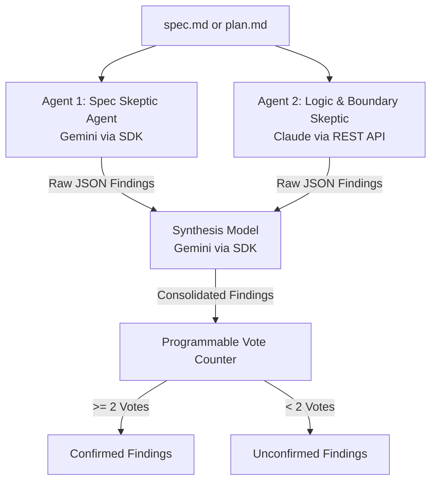

# Cloud Validator Skill

The `cloud-validator` skill performs adversarial reviews on software specifications (`spec.md`) and implementation plans (`plan.md`) using direct foundation models on **Google Cloud Platform (Vertex AI)** and synthesizes their output.

---

## 🎯 Architecture Overview

Unlike previous implementations that required provisioning conversational search agent engines, `cloud-validator` interacts directly with Vertex AI foundation models, running them concurrently, and aggregates their findings using a synthesis model with a programmable quorum consensus.



1. **Parallel Execution**: Both cloud agents are called in parallel:
   - **Agent 1 (Spec Skeptic)** runs remotely on Vertex AI using a Gemini model (default: `gemini-3.5-flash`).
   - **Agent 2 (Logic & Boundary Skeptic)** runs remotely on Vertex AI using an Anthropic Claude model (default: `claude-haiku-4-5`) via the raw prediction REST API.
2. **Synthesis Model**: Consolidates, groups, and validates findings using Gemini on Vertex AI (default: `gemini-3-1-flash-lite`).
3. **Quorum Logic**: Computes voting programmatically:
   - Spec Skeptic validation = 1 vote
   - Logic Skeptic validation = 1 vote
   - Synthesis model validation = 1 vote
   - If findings reach $\ge 2$ votes, they are marked as **Confirmed**; otherwise, they remain **Unconfirmed**.

---

## 🛠️ Components & File Map

*   **Skill Instructions**: [SKILL.md](SKILL.md)
*   **Configuration Settings**: [config.json](config.json) — Customizes GCP resources and model parameters.
*   **Main Entry Point**: [validator.py](validator.py) — CLI parsing and markdown report formatting.
*   **Vertex Client Engine**: [client.py](client.py) — Manages session creation, Gemini GenerativeModel queries, and Claude raw prediction REST requests.
*   **Synthesis Engine**: [synthesis.py](synthesis.py) — Communicates with the remote synthesis model and resolves programmatic vote counts.

---

## 🚀 Setup & Execution

### 1. Prerequisites & Virtual Environment
Ensure you create a clean local virtual environment and install the required dependencies:
```bash
# Create local virtual environment
uv venv

# Activate the virtual environment
source .venv/bin/activate

# Install required packages
uv pip install pytest pytest-asyncio httpx google-auth google-cloud-aiplatform
```

### 2. Google Cloud Setup & Authentication
Authenticate using Google Cloud Application Default Credentials (ADC):
```bash
gcloud auth application-default login
```
Ensure your target Google Cloud Project ID is configured either in `config.json` or exported via environment variables.

*Note: The platform provisioning script (`scripts/provision_agents.py`) is deprecated and no longer needed as agents are called directly.*

---

## ⚙️ Configuration

Customize settings inside [config.json](config.json). You can also override configuration via environment variables:

| config.json Key | Env Variable Override | Description | Default |
|---|---|---|---|
| `gcp_project_id` | `GOOGLE_CLOUD_PROJECT` or `CLOUD_VALIDATOR_PROJECT` | Target GCP Project ID | — |
| `gcp_location` | `CLOUD_VALIDATOR_LOCATION` | Location region | `us` |
| `agent_1_model` | `CLOUD_VALIDATOR_AGENT_1_MODEL` | Spec Skeptic Model Name | `gemini-3.5-flash` |
| `agent_2_model` | `CLOUD_VALIDATOR_AGENT_2_MODEL` | Logic Skeptic Model Name | `claude-haiku-4-5` |
| `synthesis_model` | `CLOUD_VALIDATOR_SYNTHESIS_MODEL` | Synthesis Model Name | `gemini-3-1-flash-lite` |
| `synthesis_temperature` | `CLOUD_VALIDATOR_TEMP` | Synthesis temperature | `0.15` |
| `synthesis_max_output_tokens` | `CLOUD_VALIDATOR_MAX_TOKENS` | Max output tokens | `8192` |
| `api_timeout_seconds` | `CLOUD_VALIDATOR_TIMEOUT` | Timeout in seconds | `30` |
| `api_max_retries` | `CLOUD_VALIDATOR_RETRIES` | Max retries | `3` |

### Location Restrictions
The GCP location is strictly restricted to either `us` or `global` (defaulting to `us`). If any other location is specified, it will automatically fallback to `us`. The Claude raw prediction REST API URL gets formatted with this restricted location.

---

## 💻 Usage

To validate a specification or implementation plan document:
```bash
python3 plugins/plan/skills/cloud-validator/validator.py --file path/to/spec.md
```
Or run directly through the `agy` CLI:
```bash
agy plan cloud-validator --file path/to/spec.md
```

### Output
The command prints status to console and outputs a structured Markdown report to `./cloud-validation-report.md`.
*   **Exit Code `0`**: Validation passed (no confirmed findings).
*   **Exit Code `1`**: Validation failed (at least one confirmed finding requiring resolution).

---

## 🧪 Testing

The implementation is verified with unit and E2E integration test suites.

*   **Unit Tests** (fully mocked, can be run offline without GCP credentials):
    ```bash
    pytest plugins/plan/skills/cloud-validator/tests/unit
    ```
*   **E2E Integration Tests** (runs against Vertex AI, requires GCP authentication):
    ```bash
    pytest plugins/plan/skills/cloud-validator/tests/integration
    ```
